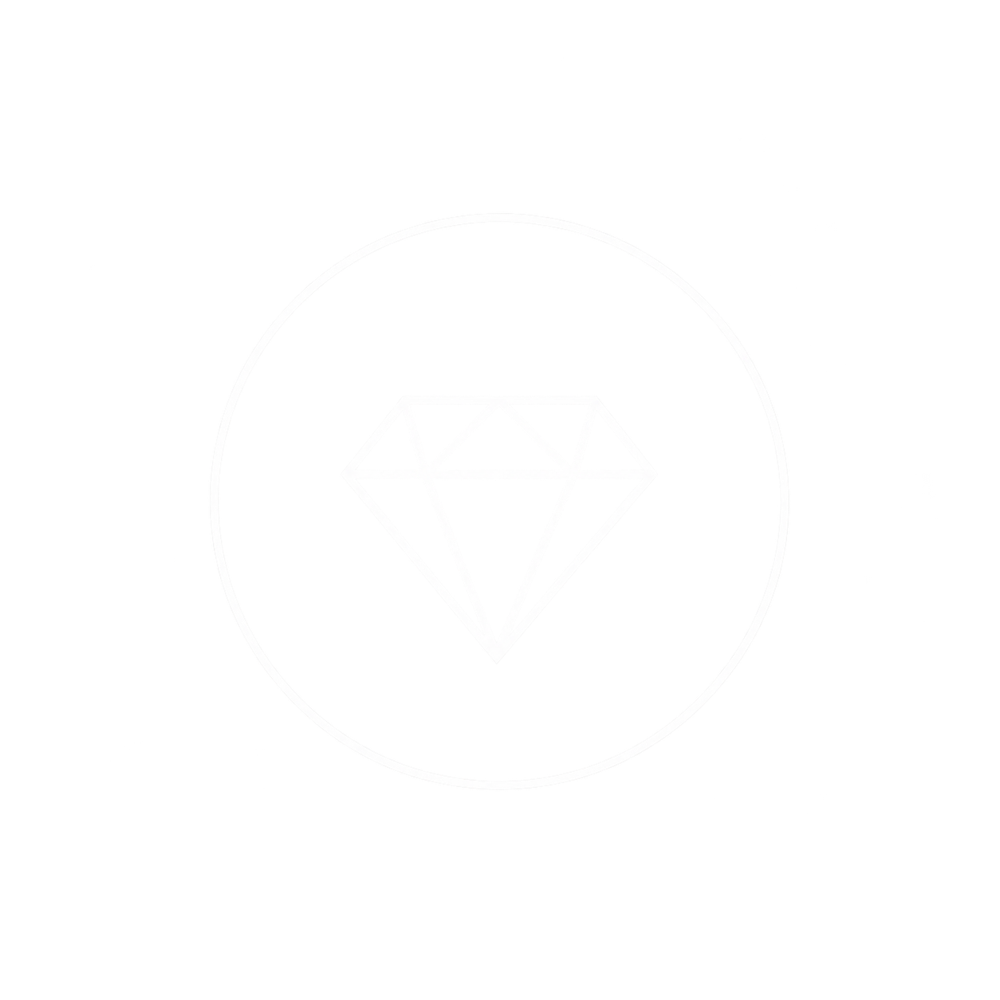
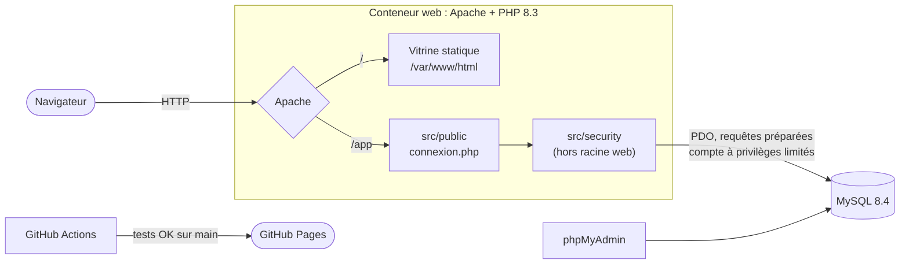
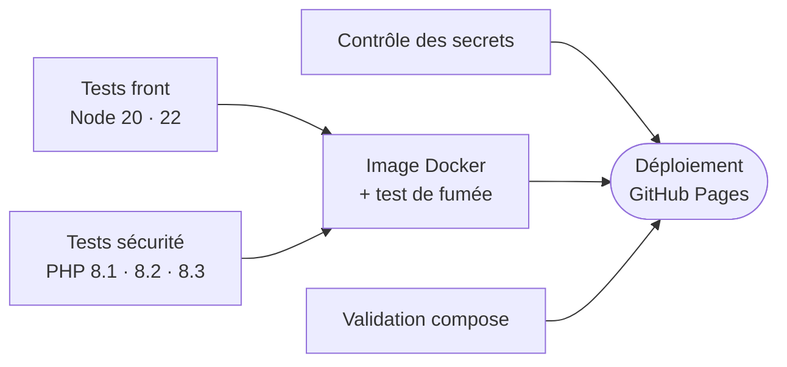

<div align="center">



# ZenCamp

**Séjours bien-être au bord du lac : yoga, méditation, digital detox**

[](https://github.com/Spam0000/ZenCamp/actions/workflows/ci-cd.yml)


[**Voir le site en ligne**](https://spam0000.github.io/ZenCamp/) · [Démarrage rapide](#-démarrage-rapide) · [Sécurité](#-sécurité) · [Tests](#-tests) · [CI/CD](#%EF%B8%8F-intégration-et-déploiement-continus)

</div>

---

## 📖 Sommaire

- [Présentation](#-présentation)
- [Fonctionnalités](#-fonctionnalités)
- [Technologies](#%EF%B8%8F-technologies)
- [Architecture](#-architecture)
- [Arborescence](#-arborescence)
- [Démarrage rapide](#-démarrage-rapide)
- [Configuration](#%EF%B8%8F-configuration)
- [Sécurité](#-sécurité)
- [Tests](#-tests)
- [Intégration et déploiement continus](#%EF%B8%8F-intégration-et-déploiement-continus)
- [Développement du front](#-développement-du-front)
- [Crédits et licence](#-crédits-et-licence)

---

## 🧘 Présentation

**ZenCamp** est un domaine de séjours bien-être installé sur les rives d'un lac : cinq cottages tournés vers l'eau, qui accueillent des retraites de yoga, des stages de méditation et des séjours de digital detox, en individuel, en groupe ou pour des événements.

Le dépôt contient deux choses :

1. **La vitrine** : un site statique d'une page qui présente le domaine, les cottages et un formulaire de demande de réservation. Il est publié automatiquement sur GitHub Pages.
2. **Le socle de la future plateforme e-commerce** : une bibliothèque de sécurité en PHP 8 (injection SQL, XSS, CSRF, force brute, mots de passe, sessions, RGPD), une pile Docker et une campagne de tests automatisés.

> [!NOTE]
> La vitrine est un front-end statique. Le code PHP de `src/` est une implémentation de référence : il n'est pas encore relié à `index.html`.

---

## ✨ Fonctionnalités

### Vitrine

| Section | Ancre | Contenu |
|---|---|---|
| Présentation | `#intro` | Le domaine, son rythme de séjour, les formules proposées |
| Nos cottages | `#work` | Cinq fiches : photo, capacité, surface, tarif par nuit |
| Réservation | `#about` | Formulaire de demande avec consentement RGPD obligatoire |
| Contact | `#contact` | Formulaire de contact et réseaux sociaux |

**Les cottages**

| Cottage | Capacité | Surface | Tarif / nuit |
|---|:-:|:-:|:-:|
| Le Héron | 6 pers. | 85 m² | 240 € |
| La Roselière | 6 pers. | 75 m² | 210 € |
| Le Martin-Pêcheur *(digital detox)* | 4 pers. | 60 m² | 265 € |
| La Brume du Lac | 2 pers. | 35 m² | 130 € |
| La Villa du Ponton *(groupes)* | 8 pers. | 120 m² | 350 € |

**Formulaire de réservation** : nom, e-mail, téléphone, cottage, dates d'arrivée et de départ, nombre de personnes (1 à 8), formule (séjour libre, yoga, méditation, digital detox, groupe), précisions et case de consentement.

Le champ téléphone est **formaté pendant la saisie** (`0600000000` → `06 00 00 00 00`) par [`assets/js/telephone.js`](assets/js/telephone.js). Seuls les chiffres sont gardés, dans la limite de 10, et le curseur reste à sa place. Le module fonctionne dans le navigateur et sous Node, ce qui permet de le tester.

### Socle back-end

- Page de connexion d'exemple, [`src/public/connexion.php`](src/public/connexion.php), qui assemble toutes les protections sur un cas réel
- Bibliothèque de sécurité en huit classes (détail dans [Sécurité](#-sécurité))
- Pile Docker complète : Apache + PHP 8.3, MySQL 8.4, phpMyAdmin
- 68 tests automatisés joués à chaque push

---

## 🛠️ Technologies

| Domaine | Technologie |
|---|---|
| Structure | HTML5 |
| Style | CSS3, Sass (SCSS) |
| Interactivité | JavaScript, jQuery |
| Icônes | Font Awesome |
| Gabarit de base | [Dimension](https://html5up.net/dimension) par HTML5 UP |
| Back-end | PHP 8.1+ / PDO |
| Base de données | MySQL 8.4 (InnoDB, utf8mb4) |
| Serveur | Apache 2 (`mod_headers`, `mod_rewrite`) |
| Conteneurs | Docker, Docker Compose |
| Tests | `node --test` (JS), micro-cadre maison (PHP) |
| CI/CD | GitHub Actions, GitHub Pages |

---

## 🧩 Architecture



Côté vitrine, `index.html` porte le contenu, `assets/css` la mise en forme (compilée depuis `assets/sass`), `assets/js` l'interactivité, et `images/` les visuels.

Côté serveur, l'image Docker reprend la séparation attendue en production :

- `/var/www/html` (racine web) ne contient **que** la vitrine statique ;
- `/var/www/zencamp` contient le code PHP, **hors** racine web ;
- seul `src/public` est exposé, via l'alias `/app` ;
- `src/`, `src/config/` et `tests/` sont refusés par Apache, et `src/.htaccess` ajoute une seconde barrière.

---

## 📁 Arborescence

```text
ZenCamp/
├── .github/workflows/
│   └── ci-cd.yml                   # Pipeline d'intégration et de déploiement continus
├── index.html                      # Page unique de la vitrine
├── assets/
│   ├── css/                        # Feuilles de style compilées (main, noscript, Font Awesome)
│   ├── sass/                       # Sources SCSS
│   │   ├── base/                   #   reset, typographie, page
│   │   ├── components/             #   boutons, formulaires, cottages, logo…
│   │   ├── layout/                 #   header, footer, wrapper, arrière-plan
│   │   └── libs/                   #   variables, mixins, fonctions, breakpoints
│   ├── js/
│   │   ├── main.js                 # Navigation entre les articles, animations
│   │   ├── util.js                 # Utilitaires du gabarit
│   │   ├── telephone.js            # Formatage du champ téléphone (testé)
│   │   └── jquery / browser / breakpoints (.min.js)
│   └── webfonts/                   # Polices Font Awesome
├── images/
│   ├── logo-zencamp.png
│   ├── cottages/                   # Photos des 5 cottages (.webp) + README
│   └── bg.jpg, overlay.png, pic0*.jpg
├── src/                            # Back-end PHP (implémentation de référence)
│   ├── .htaccess                   # Durcissement Apache de tout src/
│   ├── config/
│   │   └── config.example.php      # Modèle ; config.php est ignoré par git
│   ├── public/
│   │   └── connexion.php           # Seul point d'entrée exposé
│   └── security/                   # Bibliothèque de sécurité (8 classes)
├── tests/
│   ├── README.md                   # Détail de la campagne
│   ├── js/                         # 18 tests front (Node)
│   └── php/                        # 50 tests de sécurité (PHP)
├── docker/
│   ├── apache/zencamp.conf         # Alias /app, accès refusés, en-têtes de sécurité
│   ├── php/zencamp.ini             # Réglages PHP durcis
│   └── mysql/30-utilisateur-docker.sql
├── Dockerfile                      # Image Apache + PHP 8.3
├── docker-compose.yml              # web + db + phpMyAdmin (+ tests)
├── .env.example                    # Modèle des variables de la pile
└── LICENSE.txt                     # Licence du gabarit HTML5 UP (CC BY 3.0)
```

---

## 🚀 Démarrage rapide

### Option 1 : la vitrine seule

Aucune installation n'est nécessaire : ouvrez `index.html` dans un navigateur, ou servez le dossier :

```bash
npx serve .            # ou : python -m http.server 8000
```

### Option 2 : la pile complète avec Docker

**Prérequis** : Docker et Docker Compose.

```bash
git clone https://github.com/Spam0000/ZenCamp.git
cd ZenCamp
cp .env.example .env            # adapter les ports et mots de passe si besoin
docker compose up -d --build
```

| Service | Adresse |
|---|---|
| Vitrine | http://localhost:8080 |
| Connexion sécurisée (exemple) | http://localhost:8080/app/connexion.php |
| phpMyAdmin | http://localhost:8081 |
| MySQL | `localhost:3306` |

> [!IMPORTANT]
> Au premier démarrage, MySQL crée et remplit la base à partir de `documentation/base-de-donnees/zencamp.sql` et `zencamp_securite.sql`. Ces scripts font partie du dossier de projet, **conservé hors dépôt**. Sans eux, la vitrine et les tests marchent, mais la base reste vide.

**Commandes utiles**

```bash
docker compose logs -f web                     # suivre les journaux du serveur
docker compose --profile tests run --rm tests  # jouer les tests PHP dans le conteneur
docker compose down                            # arrêter la pile
docker compose down -v && docker compose up -d # repartir d'une base vierge
```

En développement, `index.html`, les assets compilés, `images/`, `src/` et `tests/` sont montés en lecture seule. Une modification sur le disque se voit donc tout de suite dans le navigateur, sans reconstruire l'image.

---

## ⚙️ Configuration

Toutes les valeurs se règlent dans `.env`, créé à partir de [`.env.example`](.env.example) :

| Variable | Défaut | Rôle |
|---|---|---|
| `ZENCAMP_PORT` | `8080` | Port de la vitrine sur la machine hôte |
| `PHPMYADMIN_PORT` | `8081` | Port de phpMyAdmin |
| `MYSQL_PORT` | `3306` | Port MySQL exposé (pour Workbench, DBeaver…) |
| `MYSQL_DATABASE` | `zencamp` | Nom de la base |
| `MYSQL_ROOT_PASSWORD` | `root_developpement` | Mot de passe root (développement uniquement) |
| `ZENCAMP_DB_USER` | `zencamp_app` | Compte applicatif (`SELECT`, `INSERT`, `UPDATE`, `DELETE` seulement) |
| `ZENCAMP_DB_PASSWORD` | `mot_de_passe_developpement` | Doit correspondre à `docker/mysql/30-utilisateur-docker.sql` |
| `ZENCAMP_CLE_CHIFFREMENT` | *(vide)* | Clé AES-256 en base64 pour les données de santé |

Pour générer une clé de chiffrement :

```bash
php -r "echo base64_encode(random_bytes(32));"
```

Hors Docker, copiez `src/config/config.example.php` en `src/config/config.php`. Ce fichier lit ses valeurs dans les variables d'environnement.

> [!WARNING]
> `.env` et `src/config/config.php` sont ignorés par git et **ne doivent jamais être versionnés**. La CI refuse d'ailleurs tout push qui les contiendrait.

---

## 🔐 Sécurité

La bibliothèque [`src/security/`](src/security/) (namespace `ZenCamp\Security`) couvre les principaux risques d'une plateforme de réservation en ligne.

| Classe | Menace | Mesures |
|---|---|---|
| [`Database`](src/security/Database.php) | Injection SQL | PDO et requêtes préparées exclusivement ; liste blanche pour `ORDER BY` et `LIMIT` |
| [`Html`](src/security/Html.php) | XSS | Échappement à la sortie selon le contexte (texte, URL, `href`, JS) ; blocage de `javascript:` et `data:` ; CSP avec nonce |
| [`Csrf`](src/security/Csrf.php) | CSRF | Jeton par formulaire, à usage unique, valable 2 h ; contrôle `Origin` / `Referer` |
| [`Session`](src/security/Session.php) | Vol et fixation de session | Cookie `HttpOnly`, `Secure`, `SameSite=Strict` ; nouvel identifiant à la connexion et toutes les 15 min ; expiration après 30 min d'inactivité ou 12 h au total |
| [`Password`](src/security/Password.php) | Vol de mots de passe | Argon2id (paramètres OWASP, 64 Mo) ; 12 à 128 caractères ; rehash transparent ; hachage factice contre l'énumération des comptes |
| [`BruteForce`](src/security/BruteForce.php) | Force brute, credential stuffing | Verrouillage progressif après 5 échecs sur un compte ; blocage d'une IP qui vise plus de 10 comptes ; durée de réponse minimale constante |
| [`Validation`](src/security/Validation.php) | Entrées malveillantes | Listes blanches (texte, e-mail, dates, téléphone, énumérations) ; images vérifiées par leur signature réelle puis réencodées ; noms de fichiers aléatoires |
| [`Rgpd`](src/security/Rgpd.php) | Conformité RGPD | Preuve du consentement (art. 7) ; export JSON (art. 15 et 20) ; anonymisation plutôt que suppression (art. 17) ; chiffrement des données de santé (art. 9) |

**Durcissement du serveur**

- PHP et Apache n'annoncent pas leur version (`expose_php = Off`, `ServerTokens Prod`)
- Les erreurs vont dans les journaux, jamais dans la réponse HTTP
- En-têtes `X-Content-Type-Options`, `X-Frame-Options: DENY`, `Referrer-Policy`, `Permissions-Policy`
- Listage des répertoires désactivé ; fichiers `.sql`, `.env`, `.ini`, `.log`, `config.php` refusés
- `src/.htaccess` redirige vers HTTPS, désactive `exec`, `shell_exec`, `system`… et restreint `open_basedir`
- La base est accédée par un compte applicatif sans droits d'administration, jamais par `root`

---

## 🧪 Tests

**68 cas automatisés**, chacun avec un identifiant repris dans le plan de tests. Les tests de sécurité utilisent de vraies charges d'attaque (injection SQL, script XSS, rejeu de jeton CSRF).

| Campagne | Fichier | Identifiants | Cas |
|---|---|---|:-:|
| Formatage du téléphone | `tests/js/telephone.test.js` | TU-01 → TU-10 | 10 |
| Structure du formulaire | `tests/js/formulaire.test.js` | TS-01 → TS-08 | 8 |
| Validation des entrées | `tests/php/ValidationTest.php` | SEC-01 → SEC-11 | 11 |
| Hachage Argon2id | `tests/php/PasswordTest.php` | SEC-12 → SEC-23 | 12 |
| XSS | `tests/php/HtmlTest.php` | SEC-24 → SEC-35 | 12 |
| Injection SQL | `tests/php/DatabaseTest.php` | SEC-36 → SEC-42 | 7 |
| CSRF | `tests/php/CsrfTest.php` | SEC-43 → SEC-50 | 8 |

**Lancer les tests**

```bash
# Front : Node.js 18 ou plus
node --test tests/js/*.test.js

# Sécurité : PHP 8.1 ou plus, avec mbstring et openssl
php tests/php/run.php

# Ou sans PHP sur le poste, via Docker
docker compose --profile tests run --rm tests
```

Le lanceur PHP renvoie `0` si tous les cas passent et `1` sinon.

`BruteForce`, `Session` et `Rgpd` ne sont pas testés automatiquement : ils demandent une vraie base MySQL et un vrai contexte HTTP, et relèvent de la recette d'intégration. Plus de détails dans [`tests/README.md`](tests/README.md).

---

## ⚙️ Intégration et déploiement continus

Le pipeline [`.github/workflows/ci-cd.yml`](.github/workflows/ci-cd.yml) se lance à chaque push sur `main`, à chaque pull request, ou à la main depuis l'onglet **Actions**. Un nouveau push annule l'exécution en cours sur la même branche.



| Job | Vérifications |
|---|---|
| **Contrôle des secrets** | Aucun `config.php`, `.env` ni dossier `documentation/` versionné ; aucun mot de passe en dur dans `src/` |
| **Tests front** | 18 cas, sur Node 20 et 22 |
| **Tests de sécurité** | Syntaxe de tous les fichiers PHP, puis les 50 cas, sur PHP 8.1, 8.2 et 8.3 |
| **Image Docker** | Construction et démarrage de l'image, puis vérification que la vitrine répond, que `src/` et `tests/` ne sont **pas** accessibles et que les en-têtes de sécurité sont présents |
| **Pile compose** | Validation de `docker-compose.yml` |
| **Déploiement** | Publication de la vitrine (HTML, CSS, JS, images, sans les sources Sass) sur GitHub Pages, **seulement depuis `main` et si tous les autres jobs ont réussi** |

GitHub Pages est activé automatiquement par le pipeline au premier déploiement.

---

## 🎨 Développement du front

Les styles s'écrivent dans `assets/sass/` puis se compilent vers `assets/css/` :

```bash
npm install -g sass
sass assets/sass/main.scss assets/css/main.css --watch
sass assets/sass/noscript.scss assets/css/noscript.css
```

- **Ajouter un cottage** : dupliquer un bloc `.cottage` dans la section `#work` de `index.html`, ajouter l'image dans `images/cottages/`, puis ajouter l'option dans le `<select id="res-cottage">`.
- **Remplacer une photo** : garder le même nom de fichier. Le CSS recadre toutes les vignettes en 4:3 (voir [`images/cottages/README.md`](images/cottages/README.md)).
- **Modifier le formulaire** : les tests `TS-01` à `TS-08` contrôlent sa structure. Relancez `node --test tests/js/*.test.js` après chaque modification.

---

## 📜 Crédits et licence

- Gabarit **[Dimension](https://html5up.net/dimension)** par [HTML5 UP](https://html5up.net), sous licence [Creative Commons Attribution 3.0](LICENSE.txt)
- Icônes [Font Awesome](https://fontawesome.com)
- [jQuery](https://jquery.com)

## 👤 Auteur

Projet réalisé par **Raphaël Touzet**.
