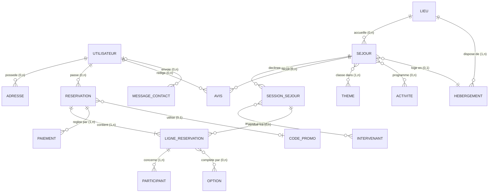
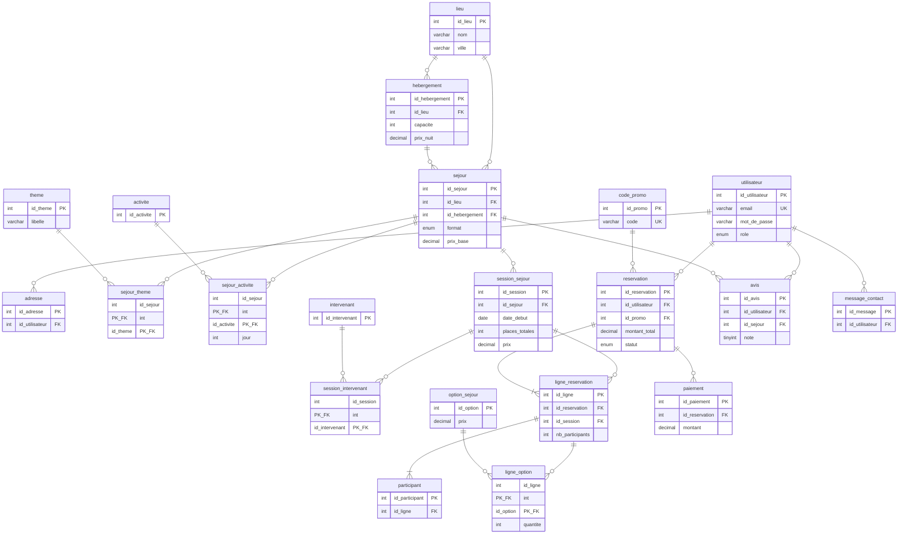

# ZenCamp — Modélisation de la base de données

Document de conception (Merise) de la base **`zencamp`** : MCD, MLD, dictionnaire des
données, relations et règles de gestion.

- SGBD retenu : **MySQL 8 / MariaDB** (moteur InnoDB, encodage `utf8mb4`)
- Script de création : [`zencamp.sql`](zencamp.sql)
- Contexte : plateforme e-commerce de vente de séjours bien-être (retraites de yoga,
  méditation, digital detox), en formats individuel, groupe ou événement spécial.

---

## 1. Règles de gestion

Ce sont les règles qui justifient chaque cardinalité du modèle.

| N° | Règle |
|----|-------|
| RG1 | Un utilisateur possède un compte identifié par une adresse e-mail **unique**. |
| RG2 | Un utilisateur peut enregistrer plusieurs adresses ; une adresse appartient à un seul utilisateur. |
| RG3 | Un séjour se déroule dans **un seul** lieu ; un lieu peut accueillir plusieurs séjours. |
| RG4 | Un lieu propose plusieurs hébergements (cottage, yourte, tente…). |
| RG5 | Un séjour appartient à un ou plusieurs **thèmes** (yoga, méditation, detox…). |
| RG6 | Un séjour est vendu via des **sessions** datées (date de début / fin, places, prix). Une session concerne un seul séjour. |
| RG7 | Une session est encadrée par un ou plusieurs **intervenants** ; un intervenant anime plusieurs sessions. |
| RG8 | Un séjour propose un programme d'**activités** ; une activité peut figurer dans plusieurs séjours. |
| RG9 | Un utilisateur passe zéro, une ou plusieurs **réservations**. Une réservation appartient à un seul utilisateur. |
| RG10 | Une réservation contient une ou plusieurs **lignes**, chaque ligne portant sur une session et un nombre de participants. |
| RG11 | Chaque participant réel (nom, prénom) est rattaché à une ligne de réservation. |
| RG12 | Une ligne de réservation peut inclure des **options** payantes (massage, navette, chambre individuelle…). |
| RG13 | Une réservation donne lieu à un ou plusieurs **paiements** (acompte + solde). |
| RG14 | Une réservation peut utiliser **au plus un** code promotionnel. |
| RG15 | Un utilisateur ne peut déposer qu'**un seul avis** par séjour, et uniquement après un séjour effectué. |
| RG16 | Un visiteur, connecté ou non, peut envoyer un message via le formulaire de contact. |

---

## 2. MCD — Modèle Conceptuel de Données

### 2.1 Représentation graphique



### 2.2 Entités et propriétés (notation Merise)

```
UTILISATEUR (id_utilisateur, nom, prenom, email, mot_de_passe, telephone,
             date_naissance, role, actif, date_inscription)

ADRESSE (id_adresse, libelle, ligne1, ligne2, code_postal, ville, pays, type_adresse)

LIEU (id_lieu, nom, description, adresse, ville, code_postal, pays,
      latitude, longitude, photo)

HEBERGEMENT (id_hebergement, nom, type_hebergement, capacite,
             prix_nuit, description)

SEJOUR (id_sejour, titre, slug, description, format, duree_jours,
        prix_base, niveau, image, statut, date_creation)

THEME (id_theme, libelle, slug, description)

ACTIVITE (id_activite, libelle, description, duree_minutes)

SESSION_SEJOUR (id_session, date_debut, date_fin, places_totales,
                places_reservees, prix, statut)

INTERVENANT (id_intervenant, nom, prenom, specialite, biographie, photo, email)

RESERVATION (id_reservation, reference, date_reservation, statut,
             montant_total, montant_remise, commentaire)

LIGNE_RESERVATION (id_ligne, nb_participants, prix_unitaire, sous_total)

PARTICIPANT (id_participant, nom, prenom, date_naissance, regime_alimentaire,
             remarque_sante)

OPTION (id_option, libelle, description, prix)

PAIEMENT (id_paiement, date_paiement, montant, moyen_paiement, statut,
          reference_transaction)

CODE_PROMO (id_promo, code, type_remise, valeur, date_debut, date_fin,
            nb_utilisations_max, nb_utilisations)

AVIS (id_avis, note, titre, commentaire, date_avis, valide)

MESSAGE_CONTACT (id_message, nom, email, sujet, message, date_envoi, traite)
```

### 2.3 Associations et cardinalités

| Association | Entités | Cardinalités | Type |
|---|---|---|---|
| Posséder | UTILISATEUR – ADRESSE | (0,n) – (1,1) | 1:N |
| Passer | UTILISATEUR – RESERVATION | (0,n) – (1,1) | 1:N |
| Rédiger | UTILISATEUR – AVIS | (0,n) – (1,1) | 1:N |
| Envoyer | UTILISATEUR – MESSAGE_CONTACT | (0,n) – (0,1) | 1:N (facultative) |
| Accueillir | LIEU – SEJOUR | (0,n) – (1,1) | 1:N |
| Disposer de | LIEU – HEBERGEMENT | (1,n) – (1,1) | 1:N |
| Loger en | SEJOUR – HEBERGEMENT | (0,1) – (0,n) | 1:N (facultative) |
| Décliner | SEJOUR – SESSION_SEJOUR | (1,n) – (1,1) | 1:N |
| Recevoir | SEJOUR – AVIS | (0,n) – (1,1) | 1:N |
| Classer | SEJOUR – THEME | (1,n) – (0,n) | **N:N** → `sejour_theme` |
| Programmer | SEJOUR – ACTIVITE | (0,n) – (0,n) | **N:N** → `sejour_activite` (porteuse : `jour`, `ordre`) |
| Animer | SESSION_SEJOUR – INTERVENANT | (1,n) – (0,n) | **N:N** → `session_intervenant` (porteuse : `role`) |
| Contenir | RESERVATION – LIGNE_RESERVATION | (1,n) – (1,1) | 1:N |
| Vendre | SESSION_SEJOUR – LIGNE_RESERVATION | (0,n) – (1,1) | 1:N |
| Concerner | LIGNE_RESERVATION – PARTICIPANT | (1,n) – (1,1) | 1:N |
| Compléter | LIGNE_RESERVATION – OPTION | (0,n) – (0,n) | **N:N** → `ligne_option` (porteuse : `quantite`, `prix_applique`) |
| Régler | RESERVATION – PAIEMENT | (1,n) – (1,1) | 1:N |
| Utiliser | RESERVATION – CODE_PROMO | (0,1) – (0,n) | 1:N (facultative) |

> Les associations **N:N** deviennent des tables au MLD ; celles qui portent des
> propriétés (`sejour_activite`, `session_intervenant`, `ligne_option`) sont des
> **associations porteuses de données**.

---

## 3. MLD — Modèle Logique de Données

Convention : <u>clé primaire soulignée</u>, `#` clé étrangère.

```
utilisateur       (id_utilisateur, nom, prenom, email, mot_de_passe, telephone,
                   date_naissance, role, actif, date_inscription)
                   PK: id_utilisateur — UNIQUE: email

adresse           (id_adresse, libelle, ligne1, ligne2, code_postal, ville, pays,
                   type_adresse, #id_utilisateur)
                   FK: id_utilisateur → utilisateur(id_utilisateur)

lieu              (id_lieu, nom, description, adresse, ville, code_postal, pays,
                   latitude, longitude, photo)

hebergement       (id_hebergement, nom, type_hebergement, capacite, prix_nuit,
                   description, #id_lieu)
                   FK: id_lieu → lieu(id_lieu)

sejour            (id_sejour, titre, slug, description, format, duree_jours,
                   prix_base, niveau, image, statut, date_creation,
                   #id_lieu, #id_hebergement)
                   FK: id_lieu → lieu(id_lieu)
                   FK: id_hebergement → hebergement(id_hebergement)  -- NULLable

theme             (id_theme, libelle, slug, description)

sejour_theme      (#id_sejour, #id_theme)                  -- table de jonction
                   PK composite (id_sejour, id_theme)

activite          (id_activite, libelle, description, duree_minutes)

sejour_activite   (#id_sejour, #id_activite, jour, ordre)  -- jonction porteuse
                   PK composite (id_sejour, id_activite)

session_sejour    (id_session, date_debut, date_fin, places_totales,
                   places_reservees, prix, statut, #id_sejour)
                   FK: id_sejour → sejour(id_sejour)

intervenant       (id_intervenant, nom, prenom, specialite, biographie, photo, email)

session_intervenant (#id_session, #id_intervenant, role)   -- jonction porteuse
                   PK composite (id_session, id_intervenant)

code_promo        (id_promo, code, type_remise, valeur, date_debut, date_fin,
                   nb_utilisations_max, nb_utilisations)
                   UNIQUE: code

reservation       (id_reservation, reference, date_reservation, statut,
                   montant_total, montant_remise, commentaire,
                   #id_utilisateur, #id_promo)
                   FK: id_utilisateur → utilisateur(id_utilisateur)
                   FK: id_promo → code_promo(id_promo)     -- NULLable
                   UNIQUE: reference

ligne_reservation (id_ligne, nb_participants, prix_unitaire, sous_total,
                   #id_reservation, #id_session)
                   FK: id_reservation → reservation(id_reservation) ON DELETE CASCADE
                   FK: id_session → session_sejour(id_session)

participant       (id_participant, nom, prenom, date_naissance, regime_alimentaire,
                   remarque_sante, #id_ligne)
                   FK: id_ligne → ligne_reservation(id_ligne) ON DELETE CASCADE

option_sejour    (id_option, libelle, description, prix)

ligne_option      (#id_ligne, #id_option, quantite, prix_applique)  -- jonction porteuse
                   PK composite (id_ligne, id_option)

paiement          (id_paiement, date_paiement, montant, moyen_paiement, statut,
                   reference_transaction, #id_reservation)
                   FK: id_reservation → reservation(id_reservation)

avis              (id_avis, note, titre, commentaire, date_avis, valide,
                   #id_utilisateur, #id_sejour)
                   FK: id_utilisateur → utilisateur(id_utilisateur)
                   FK: id_sejour → sejour(id_sejour)
                   UNIQUE (id_utilisateur, id_sejour)      -- RG15

message_contact   (id_message, nom, email, sujet, message, date_envoi, traite,
                   #id_utilisateur)
                   FK: id_utilisateur → utilisateur(id_utilisateur)  -- NULLable
```

**Bilan : 19 tables** — 14 tables d'entités + 5 tables de jonction/dépendantes.

---

## 4. Schéma relationnel (vue tables & clés étrangères)



---

## 5. Dictionnaire des données (extrait des tables clés)

### `utilisateur`
| Champ | Type | Contrainte | Description |
|---|---|---|---|
| id_utilisateur | INT UNSIGNED | PK, AUTO_INCREMENT | Identifiant du compte |
| nom / prenom | VARCHAR(80) | NOT NULL | Identité du client |
| email | VARCHAR(180) | NOT NULL, UNIQUE | Identifiant de connexion |
| mot_de_passe | VARCHAR(255) | NOT NULL | Hash bcrypt/argon2 — **jamais en clair** |
| telephone | VARCHAR(20) | NULL | Contact |
| date_naissance | DATE | NULL | Vérification de la majorité |
| role | ENUM('client','admin') | DEFAULT 'client' | Droits d'accès |
| actif | BOOLEAN | DEFAULT TRUE | Compte activé / désactivé |
| date_inscription | DATETIME | DEFAULT NOW() | Date de création du compte |

### `sejour`
| Champ | Type | Contrainte | Description |
|---|---|---|---|
| id_sejour | INT UNSIGNED | PK, AUTO_INCREMENT | Identifiant du produit |
| titre | VARCHAR(150) | NOT NULL | Nom commercial du séjour |
| slug | VARCHAR(170) | UNIQUE | URL lisible |
| description | TEXT | NULL | Présentation détaillée |
| format | ENUM('individuel','groupe','evenement') | NOT NULL | Format de vente (README) |
| duree_jours | SMALLINT | CHECK > 0 | Durée en jours |
| prix_base | DECIMAL(10,2) | CHECK >= 0 | Prix indicatif par personne |
| niveau | ENUM('debutant','intermediaire','avance','tous') | DEFAULT 'tous' | Niveau requis |
| statut | ENUM('brouillon','publie','archive') | DEFAULT 'brouillon' | Visibilité en ligne |
| id_lieu | INT UNSIGNED | FK NOT NULL | Lieu du séjour |
| id_hebergement | INT UNSIGNED | FK NULL | Hébergement associé |

### `session_sejour`
| Champ | Type | Contrainte | Description |
|---|---|---|---|
| id_session | INT UNSIGNED | PK | Identifiant de la date de départ |
| id_sejour | INT UNSIGNED | FK NOT NULL | Séjour concerné |
| date_debut / date_fin | DATE | NOT NULL, CHECK fin >= debut | Période |
| places_totales | SMALLINT | CHECK > 0 | Capacité commercialisée |
| places_reservees | SMALLINT | DEFAULT 0, CHECK <= places_totales | Stock consommé |
| prix | DECIMAL(10,2) | NOT NULL | Prix réel de cette date |
| statut | ENUM('ouverte','complete','annulee') | DEFAULT 'ouverte' | État de la session |

### `reservation`
| Champ | Type | Contrainte | Description |
|---|---|---|---|
| id_reservation | INT UNSIGNED | PK | Identifiant de commande |
| reference | VARCHAR(20) | UNIQUE | Référence client (ex. `ZC-2026-000148`) |
| id_utilisateur | INT UNSIGNED | FK NOT NULL | Client |
| id_promo | INT UNSIGNED | FK NULL | Code promo éventuel (RG14) |
| date_reservation | DATETIME | DEFAULT NOW() | Date de commande |
| statut | ENUM('panier','en_attente','confirmee','annulee','terminee') | DEFAULT 'panier' | Cycle de vie |
| montant_total | DECIMAL(10,2) | CHECK >= 0 | Total TTC après remise |
| montant_remise | DECIMAL(10,2) | DEFAULT 0 | Remise appliquée |

---

## 6. Normalisation

Le modèle est en **3e forme normale (3FN)** :

- **1FN** — toutes les valeurs sont atomiques ; aucune liste dans une colonne
  (les thèmes multiples d'un séjour passent par `sejour_theme`, les participants
  par une table dédiée).
- **2FN** — dans les tables à clé composite (`sejour_theme`, `ligne_option`,
  `session_intervenant`), chaque attribut non clé dépend de la **totalité** de la clé
  (ex. `quantite` dépend bien du couple ligne + option).
- **3FN** — aucune dépendance transitive : la ville d'un séjour n'est pas stockée dans
  `sejour` mais dans `lieu` ; le prix d'une option est dans `option`.

**Dénormalisations volontaires et assumées :**

| Colonne | Raison |
|---|---|
| `ligne_reservation.prix_unitaire`, `ligne_option.prix_applique` | Le prix doit être **figé à la commande** : si le tarif change plus tard, l'historique des réservations reste juste. |
| `reservation.montant_total` | Évite de recalculer l'agrégat à chaque affichage de commande. |
| `session_sejour.places_reservees` | Compteur de stock — permet de vérifier la disponibilité sans agréger les lignes de réservation. À maintenir en transaction. |

---

## 7. Points d'attention techniques

- **Transactions** : la création d'une réservation (insertion des lignes +
  incrément de `places_reservees` + paiement) doit être atomique (InnoDB, `START
  TRANSACTION` / `COMMIT`) pour éviter la survente.
- **Suppressions** : `ON DELETE CASCADE` sur `ligne_reservation` et `participant`
  (dépendants d'une réservation) ; `ON DELETE RESTRICT` sur les catalogues (`sejour`,
  `lieu`) pour ne jamais casser l'historique de vente.
- **RGPD** : `participant.remarque_sante` est une donnée sensible → accès restreint,
  chiffrement au repos recommandé, purge après le séjour.
- **Sécurité** : `mot_de_passe` stocke un hash (bcrypt / argon2id), requêtes
  préparées obligatoires côté back-end.
- **Index** : posés sur toutes les FK, plus `sejour(statut, format)`,
  `session_sejour(date_debut)` et `reservation(statut)` pour les filtres du catalogue
  et du back-office.
